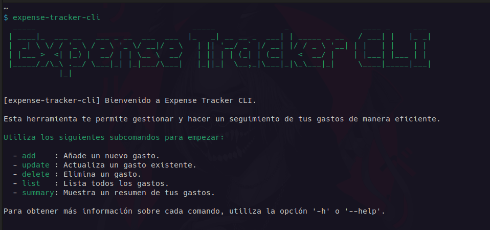
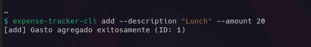
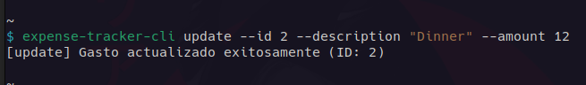
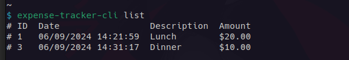
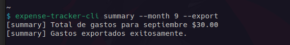
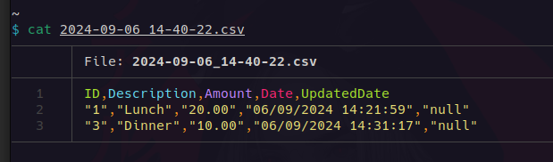

# expense-tracker-cli

Esta es una aplicación de línea de comandos para el seguimiento de gastos, diseñada para ayudar a los usuarios a administrar sus finanzas de manera eficiente. 
Permite agregar, actualizar, eliminar, ver y exportar gastos en formato CSV. Además, puedes obtener resúmenes detallados de tus gastos, incluyendo un resumen mensual.

El proyecto está basado en una propuesta de [Roadmap.sh.](https://roadmap.sh/projects/expense-tracker)



<div id="indice" >

## **Índice**

1. [Índice](#indice)
2. [Características](#caracteristicas)
3. [Requisitos](#requisitos)
4. [Implementación](#implementacion)
5. [Instalación](#instalacion)
6. [Crear archivo ejecutable](#crear-archivo-ejecutable-opcional)
7. [Usar el JAR directamente](#usar-el-jar-directamente)
8. [Salidas de ejemplo](#salidas-de-ejemplo)
9. [Exportación a CSV](#exportacion-a-csv)


<div id="caracteristicas" >

## Características
- Agregar un gasto con descripción y cantidad.
- Actualizar un gasto existente.
- Eliminar un gasto.
- Visualizar todos los gastos registrados.
- Obtener un resumen de todos los gastos totales.
- Resumen mensual de los gastos de un mes específico (del año en curso).
- Exportar gastos a un archivo CSV, con posibilidad de resumen mensual o total.

</div>

## Requisitos

- **Java:** Asegúrate de tener instalado Java (al menos la versión 11).
- **Maven**: Utilizado para gestionar las dependencias y construir el proyecto.

<div id="implementacion" >

## Implementación

Para la implementación de esta aplicación, utilicé las siguientes tecnologías:

- [**Java**](https://www.java.com/es/) con [**Maven**](https://maven.apache.org/) como gestor de dependencias.
- [**Picocli**](https://picocli.info/) como biblioteca para el análisis de comandos en proyectos de CLI con Java.
- [**CSV**](https://en.wikipedia.org/wiki/Comma-separated_values) como formato de archivo para exportar el resumen de los gastos.
- [**JSON**](https://es.wikipedia.org/wiki/JSON) como formato de archivo para almacenamiento de los gastos.

</div>

<div id="instalacion" >

## Instalación

  1. Clonar el repositorio
      ```bash
      git clone https://github.com/mrodriguezdev/expense-tracker-cli.git
       ```
  2. Navega al directorio del proyecto
      ```bash
      cd expense-tracker-cli
      ```
  3. Compila el proyecto usando Maven
      ```bash
      mvn clean install
      ```
</div>

## Crear archivo ejecutable (opcional)

Para facilitar el uso del programa sin tener que ejecutar `java -jar` cada vez, puedes crear un archivo ejecutable. Aquí te explico cómo hacerlo:

1. Crea un archivo llamado `expense-tracker-cli` en cualquier directorio temporal (como /tmp) con el siguiente contenido:
   ```bash
   #!/bin/bash

    JAR_PATH="/opt/expense-tracker-cli/expense-tracker-cli-1.0-SNAPSHOT-jar-with-dependencies.jar"
    
    if ! command -v java &> /dev/null
    then
        echo "Error: Java no está instalado. Por favor, instala Java para ejecutar este programa."
        exit 1
    fi
    
    if [ -f "$JAR_PATH" ]; then
      java -jar "$JAR_PATH" "$@"
    else
      echo "Error: No se encontró el archivo JAR en $JAR_PATH"
      exit 1
    fi
   ```
2. Mover el archivo a `/usr/bin`
    ```bash
   sudo mv /tmp/expense-tracker-cli /usr/bin/
    ```
3. Asignar permisos de ejecución
    ```bash
   sudo chmod +x /usr/bin/expense-tracker-cli
    ```
Ahora puedes ejecutar la aplicación con el comando `expense-tracker-cli`.

## Usar el JAR directamente
Si prefieres no crear el ejecutable, también puedes usar el comando `java -jar` para ejecutar el programa.

```bash
java -jar target/expense-tracker-cli-1.0-SNAPSHOT-jar-with-dependencies.jar
```

## Salidas de ejemplo

### Agregar un gasto


### Actualizar un gasto


### Eliminar un gasto


### Listar todos los gastos


### Ver resumen de gastos


### Ver resumen mensual de gastos


<div id="exportacion-a-csv" >

## Exportación a CSV
La aplicación permite exportar tanto el resumen general como el resumen mensual de gastos a un archivo CSV, el cual puede ser procesado fácilmente en otras herramientas, 
como Excel o Google Sheets.

### Ejemplo de comando para exportar


### Contenido de archivo csv


</div>
